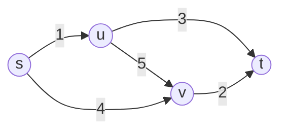
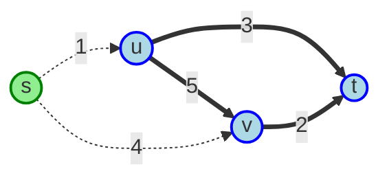
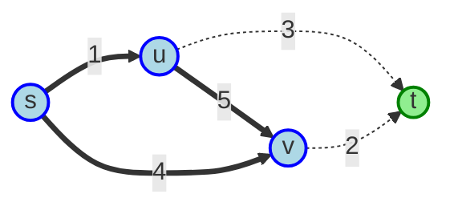
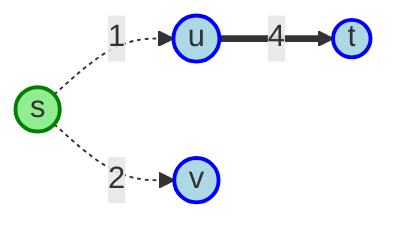
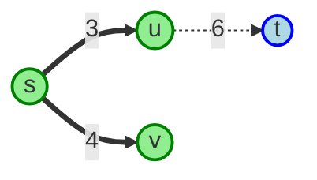

# Final exam practice

## Problem 1 (Spring 2020)

> Suppose air travel restrictions specify that one can pack in at most $k$ items
  from a specified "problemset" of items, $B$. Additionally you have a set of
  unrestricted items $A$. Let $A \cup B = S$ where
  $S = \{s_1, s_2, \ldots, s_n\}$. Each item has weight $w_i$ and provides
  benefit $b_i$. Set up a dynamic programming recurrence to solve the problem of
  packing your suitcase with maximum weight $W$ in order to maximize your
  benefit. Provide the algorithm to solve the recurrence and its complexity.

To solve this problem, we can use a dynamic programming approach similar to the
classic 0/1 knapsack problem, but with an additional constraint on the number of
restricted items that can be included. We define a 3D DP table $dp(i, w, c)$
where:

- $i$ represents the first $i$ items considered.
- $w$ represents the current weight capacity of the suitcase.
- $c$ represents the number of restricted items included so far.

The value $dp(i, w, c)$ will store the maximum benefit that can be obtained
using the first $i$ items with a weight limit of $w$ and at most $c$ restricted
items. At each benefit iteration, we use the same $c$ if the item is restricted
and $c - 1$ if the item is unrestricted and the benefit is non-zero.

```java
class Item {
  int weight; // non-negative value
  int benefit; // non-negative value
  boolean isRestricted; // true if item is in B, false if in A
}

int maxBenefit(Item[] items, int W, int k) {
  int n = items.length;
  int[][][] dp = new int[n + 1][W + 1][k + 1];

  for (int i = 1; i <= n; i++) {
    Item item = items[i - 1];
    for (int w = 0; w <= W; w++) {
      for (int c = 0; c <= k; c++) {
        dp[i][w][c] = dp[i - 1][w][c];
        if (w < item.weight) {
          continue;
        }
        if (!item.isRestricted) {
          dp[i][w][c] =
            Math.max(
              dp[i][w][c],
              dp[i - 1][w - item.weight][c] + item.benefit
            );
        } else if (c >= 1) {
          dp[i][w][c] =
            Math.max(
              dp[i][w][c],
              dp[i - 1][w - item.weight][c - 1] + item.benefit
            );
        }
      }
    }
  }

  int max = 0;
  for (int w = 0; w <= W; w++) {
    for (int c = 0; c <= k; c++) {
      max = Math.max(max, dp[n][w][c]);
    }
  }
  return max;
}
```

The time complexity of this algorithm is dominated by three nested loops,
resulting in $O(n \cdot W \cdot k)$, where $n$ is the number of items, $W$ is
the maximum weight capacity of the suitcase and $k$ is the maximum number of
restricted items allowed.

$$
\begin{align}
  T(\textsf{total}) &=
    T(\textsf{create DP}) +
    T(\textsf{fill DP}) +
    T(\textsf{find max}) \\
  &=
    O(1) +
    \underbrace{O(n \cdot W \cdot k)}_\textsf{dominant} +
    O(W \cdot k) \\
  &= \mathbf{O(n \cdot W \cdot k)}
\end{align}
$$

## Problem 2 (Spring 2020)

> Suppose we want to test a circuit modeled as an undirected graph $G$ as
  follows: We want to test each arc $ij$, $\alpha_{ij}$ times and suppose there
  is a constraint that each hour we can test at most $\beta_j$ arcs incident to
  any node $j$. Find a schedule that completes the testing of all the arcs in
  the fewest number of hours. [**Hint:** Use flows]

This problem can be framed as a series of maximum flow problems, where the value
of the flow represents the number of arcs tested in a given hour. For each hour
$t$, create a flow with source node $s$, sink node $t$, and intermediate nodes
$v_j$ for each vertex $j \in G$, $e_{ij}$ for each edge $ij \in G$ and
$h_t \in \{1, 2, \ldots, T\}$. The capacities of the edges are defined as
follows:

- $s \to e_{ij}$ with capacity $\alpha_{ij}$, each edge needs $\alpha_{ij}$
  tests.
- $e_{ij} \to h_t$ with a capacity of 1, each edge is tested at most once per
  hour.
- $h_t \to v_j$ with capacity $\beta_j$, vertex capacity per hour.
- $v_j \to t$ with infinite capacity, total capacity across all hours.

To find the minimum number of hours $T$ required to complete all tests, we can
perform a binary search on $T$. For each candidate value of $T$, we construct
the flow network as described above and compute the maximum flow from $s \to t$.
If the maximum flow equals the total number of tests required (i.e., the sum of
all $\alpha_{ij}$), then it is possible to complete the tests in $T$ hours. If
not, we need to increase $T$.

## Problem 3 (Spring 2020)

> 1.  Determine if the following claims are true or false for a flow network
      comprising a directed graph $G$ with capacities on the edges and a source
      and destination vertex:
>     1.  If all edges in a network have different capacities then the network
          has a unique minimum cut.
>     1.  If we add a positive number $\lambda$ to each arc capacity, the
          minimum capacity $s - t$ cut $(A, B)$ remains unchanged.

**1A: False.** Consider the flow network with vertices $\{s, u, v, t\}$ and
edges:



The capacities of the edges are all different. The minimum cuts in this network
are $(\{s\}, \{u, v, t\})$ and $(\{s, u, v\}, \{t\})$, both with a capacity of
5.





**1B: False.** In this example, the minimum cut is $(\{s\}, \{u, v, t\})$ with a
capacity of 3.



When we add $\lambda = 2$ to each edge capacity, the new minimum cut becomes
$(\{s, u, v\}, \{t\})$ with a capacity of 6.



> 2.  Suppose that you have wrongly estimated the capacity of an edge while
      finding the maximum flow. Show how to adjust the flow to the maximum flow
      using the modified capacity. Also give the time complexity of your
      procedure in the two cases when the capacity is over-estimated by one and
      when it is under-estimated by one unit.

Suppose we have computed the maximum flow $f$ based on an incorrect capacity
$c'(e)$ for edge $e = (u, v)$, but the true capacity is $c(e)$.

When capacity is over-estimated by one unit, $c(e) = c'(e) - 1$. If the current
flow $f(e) \leq c(e)$, then the flow remains feasible. Otherwise, reduce the
flow on edge $e$ by 1 unit, $f(e) = c(e)$, and adjust the flow accordingly using
the residual graph. The time complexity for this adjustment is $O(|V| + |E|)$
for one BFS/DFS traversal of the residual graph, or $O(1)$ if no adjustment is
needed.

When capacity is under-estimated by one unit, $c(e) = c'(e) + 1$. The current
flow is already feasible because $f(e) \leq c'(e) < c(e)$. In the residual
graph, add an additional capacity of 1 unit to edge $e$. Search for an
augmenting path using BFS/DFS from $s$ to $t$ in the residual graph.
If such a path exists, augment the flow along this path by 1 unit to obtain the
new maximum flow. Otherwise, the current flow is already maximum. The time
complexity for this adjustment is also $O(|V| + |E|)$ for BFS/DFS traversal of
the residual graph.

## Problem 4 (Spring 2020)

> Are the following problems solvable in polynomial time or are they
  NP-Complete?
>
> 1.  Consider the following problem. You are given positive integers
      $x_1, \ldots , x_n$, and numbers $k$ and $B$. You want to know whether it
      is possible to partition the numbers $\{x_i\}$ into $k$ sets
      $S_1, \ldots , S_k$ so that the squared sums of the sets add up to at most
      $B$:
>
>     $$
>     \sum_{i = 1}^k \left( \sum_{x_j \in S_i} x_j \right)^2 \leq B
>     $$
>
>     Show that this problem is NP-complete. (Hint: Reduce from the partition
      problem.)

To show that this problem is NP-Complete, we can reduce from the well-known
`PARTITION` problem, which is NP-Complete. We need to show that a polynomial
time reduction from the `PARTITION` problem is possible so that
$\texttt{PARTITION} \leq_P \texttt{SQUARED-SUM-PARTITION}$. Given an instance of
the `PARTITION` problem with a set of integers $S = \{x_1, x_2, \ldots, x_n\}$,
we can construct an instance of the `SQUARED-SUM-PARTITION` problem as follows:

- Set $k = 2$, partitioning the set into two subsets.
- Set $x_i = y_i$ for all $i$.
- Set $B = 2 \cdot (S / 2)^2 = S^2 / 2$, where $S$ is the sum of all integers in
  the original set.

If there exists a partition of the original set into two subsets with equal sum,
then the squared sums of these subsets will be equal to $B$. Conversely, if
there exists a partition of the integers into two subsets such that the squared
sums add up to at most $B$, then the sums of these subsets must be equal, thus
solving the `PARTITION` problem. Thus, we have shown that `PARTITION` can be
reduced to `SQUARED-SUM-PARTITION` in polynomial time, proving that
`SQUARED-SUM-PARTITION` is NP-Complete.

> 2.  Given an undirected graph $G = (V, E)$: Is there a spanning tree with at
      most $k$ leaves?

The `HAMPATH` problem is known to be NP-Complete. We can reduce the `HAMPATH`
to this problem so that $\texttt{HAMPATH} \leq_P \texttt{k-LEAF SPANNING-TREE}$.
Given a graph $G = (V, E)$, we can set $k = 2$. If there exists a Hamiltonian
path in $G$, then this path is a spanning tree with exactly two leaves.
Conversely, if there exists a spanning tree with at most two leaves, then this
spanning tree must be a Hamiltonian path. Thus, we have shown that `HAMPATH` can
be reduced to `k-LEAF SPANNING-TREE` in polynomial time, proving that
`k-LEAF SPANNING-TREE` is NP-Complete.

## Problem 5 (Fall 2023)

> Are the following problems solvable in polynomial time or are they
  NP-Complete: Given anundirected graph $G = (V, E)$:
>
> 1.  Is there a $s - t$ Hamiltonian path in the graph, i.e. a path that starts
      at a given $s$ and ends at the given $t$ and visits every vertex once and
      only once (Not a cycle).

The `HAMPATH` problem is known to be NP-Complete. To show that the
`s - t HAMPATH` is NP-Complete, we need to show that a polynomial time reduction
from the `HAMPATH` is possible so that
$\texttt{HAMPATH} \leq_P s - t\ \texttt{HAMPATH}$. Given a graph $G = (V, E)$,
we can construct a new graph $G' = (V', E')$ as follows:

- Add two new vertices $s$ and $t$ to $V$ to form $V' = V \cup \{s, t\}$.
- For each vertex $v \in V$, add edges $(s, v)$ and $(v, t)$ to $E'$.
- Retain all original edges in $E$ to form
  $E' = E \cup \{(s, v) | v \in V\} \cup \{(v, t) | v \in V\}$.

If $G$ has a Hamiltonian path, then there exists a path in $G'$ that starts at
$s$, visits all vertices in $V$ exactly once, and ends at $t$. Conversely, if
there exists a path in $G'$ that starts at $s$, visits all vertices in $V$
exactly once, and ends at $t$, then removing $s$ and $t$ from this path gives a
Hamiltonian path in $G$. Thus, we have shown that `HAMPATH` can be reduced to
`s - t HAMPATH` in polynomial time, proving that `s - t HAMPATH` is NP-Complete.

> 2.  Given a graph $G = (V, E)$ and a subset $L$ of $V$, is there a spanning
      tree with all leaves contained in $L$?

All Hamiltonian paths in a graph are spanning trees. Thus, we can reduce the
`s - t HAMPATH` to this problem so that
$s - t\ \texttt{HAMPATH} \leq_P L\ \texttt{SPANNING-TREE}$. Set $L = \{s, t\}$
where $s$ and $t$ are the start and end vertices of the Hamiltonian path. If
there exists a spanning tree with all leaves in $L$, then the spanning tree must
be a Hamiltonian path from $s$ to $t$. Conversely, if there exists a Hamiltonian
path from $s$ to $t$, then this path is a spanning tree with all leaves in $L$.
Thus, we have shown that `s - t HAMPATH` can be reduced to
`L SPANNING-TREE` in polynomial time, proving that `L SPANNING-TREE` is
NP-Complete.

> 3.  Is there a spanning tree with at most $k$ leaves?

The `L SPANNING-TREE` problem can be reduced to this problem so that
`L SPANNING-TREE` $\leq_P$ `k-LEAF SPANNING-TREE`. Given a graph $G = (V, E)$
and a subset $L$ of $V$, we can set $k = |L|$. If there exists a spanning tree
with all leaves in $L$, then this spanning tree has at most $k$ leaves.
Conversely, if there exists a spanning tree with at most $k$ leaves, we can
check if all leaves are contained in $L$. Thus, we have shown that
`L SPANNING-TREE` can be reduced to `k-LEAF SPANNING-TREE` in polynomial time,
proving that `k-LEAF SPANNING-TREE` is NP-Complete.
