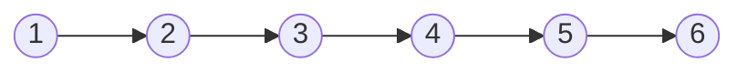
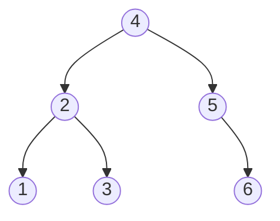
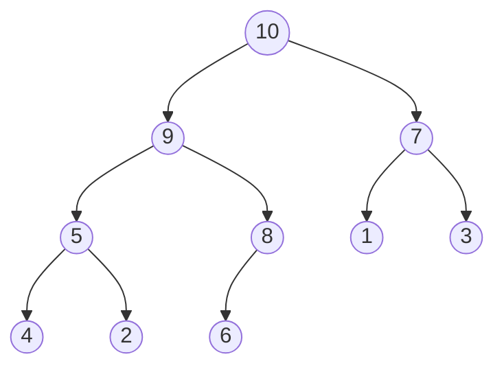
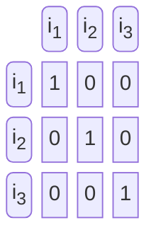
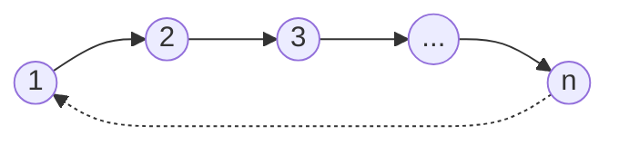
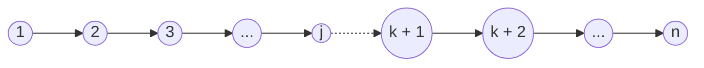

# [Homework 2](https://github.com/hanggrian/IIT-CS535/blob/assets/assignments/hw2.pdf)

## Problem 1

> This problem refers to binary search trees as defined in the *Chapter 12* of
  the textbook. Show that one `TREE-MINIMUM` followed by $(n − 1)$ calls to
  `TREE-SUCCESSOR` takes $\Theta(n)$ times. In which order are the nodes
  visited?
>
> > ```
> > TREE-MINIMUM(x)
> > 1   while x.left != NIL
> > 2     x = x.left
> > 3   return x
> > ```
> >
> > ```
> > TREE-SUCCESSOR(x)
> > 1   if x.right != NIL
> > 2     return TREE-MINIMUM(x.right)
> > 3   y = x.p
> > 4   while y != NIL and x = y.right
> > 5     x = y
> > 6     y = y.p
> > 7   return y
> > ```

A node in a binary search tree and its right subtree are always greater than its
left subtree. To find the minimum node of BST, `TREE-MINIMUM` recursively
traverses the left child until it no longer has a left child. For
`TREE-SUCCESSOR`, it calls `TREE-MINIMUM` on the node’s right child or traverses
the parent until one is found where its left subtree includes the input node.



In a completely unbalanced BST, where each node has only one right child until
it is a leaf, the initial `TREE-MINIMUM` call takes $O(n)$ to traverse from leaf
to root. However, consecutive `TREE-SUCCESSOR` calls are $O(1)$ each, since the
right child is always present.

$$
\begin{align}
  T(n) &= T(\texttt{TREE-MINIMUM}(x)) + (n - 1) \cdot
    T(\texttt{TREE-SUCCESSOR}(x)) \\
  &= O(n) + (n - 1) \cdot O(1) \\
  &= O(n) + \Theta(n) \\
  &= O(n) + \underbrace{\Theta(n)}_\textsf{dominant} \\
  &= \mathbf{\Theta(n)}
\end{align}
$$



The height of a balanced BST is $\lg(n)$, so `TREE-MINIMUM` takes $O(\lg(n))$
to traverse from root to leftmost leaf. A `TREE-SUCCESSOR` call can be
$O(\lg(n))$ when the input node is a leaf and the successor is the root, but is
mostly $O(1)$ to traverse up or right downwards.

$$
\begin{align}
  T(n) &= T(\texttt{TREE-MINIMUM}(x)) + (n - 1) \cdot
    T(\texttt{TREE-SUCCESSOR}(x)) \\
  &= O(\lg(n)) + (n - 1) \cdot O(1) \\
  &= O(\lg(n)) + \underbrace{\Theta(n)}_\textsf{dominant} \\
  &= \mathbf{\Theta(n)}
\end{align}
$$

The node traversal begins with the smallest key, using a `TREE-MINIMUM` call.
The key gradually increases for each `TREE-SUCCESSOR` until the last successor,
which is the highest key.

## Problem 2

> This problem refers to binary max-heaps as defined in the *Chapter 6* of the
  textbook, and the operations described and implemented there. We want to claim
  an amortized cost of $O(1)$ for `EXTRACT-MAX`, which is actually possible with
  an amortized cost of $O(\lg(n))$ for `INSERT`. Find a potential function
  $\Phi$ to obtain these bounds.
>
> > ```
> > HEAP-EXTRACT-MAX(A)
> > 1   if A.heap-size < 1
> > 2     error "heap underflow"
> > 3   max = A[1]
> > 4   A[1] = A[A.heap-size]
> > 5   A.heap-size = A.heap-size - 1
> > 6   MAX-HEAPIFY(A, 1)
> > 7   return max
> >
> > MAX-HEAPIFY(A, i)
> > 1   l = LEFT(i)
> > 2   r = RIGHT(i)
> > 3   if l <= A.heap-size and A[l] > A[i]
> > 4     largest = l
> > 5   else largest = i
> > 6   if r <= A.heap-size and A[r] > A[largest]
> > 7     largest = r
> > 8   if largest != i
> > 9     exchange A[i] with A[largest]
> > 10    MAX-HEAPIFY(A, largest)
> > ```
> >
> > ```
> > MAX-HEAP-INSERT(A, key)
> > 1   A.heap-size = A.heap-size + 1
> > 2   A[A.heap-size] = -∞
> > 3   HEAP-INCREASE-KEY(A, A.heap-size, key)
> >
> > HEAP-INCREASE-KEY(A, i, key)
> > 1   if key < A[i]
> > 2     error "new key is smaller than current key"
> > 3   A[i] = key
> > 4   while i > 1 and A[PARENT(i)] < A[i]
> > 5     exchange A[i] with A[PARENT(i)]
> > 6     i = PARENT(i)
> >
> > PARENT(i)
> > 1   return ⌊i/2⌋
> > ```



In a binary max-heap, the children nodes are always less than their parent, with
the root having the maximum value. `EXTRACT-MAX` replaces the root with the last
child, which is then recursively heapified with `MAX-HEAPIFY` until the heap
property is restored. `INSERT` adds a new leaf, and depending on its key, it may
need to bubble up while swapping values with its parent using
`HEAP-INCREASE-KEY`.

In both operations, the worst-case scenario is $O(\lg(n))$ when the tree is
traversed from root to leaf or vice versa. To achieve an amortized cost of
$O(1)$ for `EXTRACT-MAX`, each `INSERT` call must be charged $O(\lg(n))$ with an
added constant value to represent the extra work. The potential function can be
defined as $\Phi(A) = c \cdot n \cdot \lg(n)$, where $c$ is a constant value and
$n$ is the `A.heap-size`.

$$
\begin{align}
  \hat{c}(\texttt{INSERT}(n)) &= T(n) + \Phi_2(A) - \Phi_1(A) \\
  &= O(\lg(n)) + c \cdot (n + 1) \cdot
    \lg(\underbrace{n}_\textsf{dominant} + 1) - c \cdot n \cdot \lg(n) \\
  &= O(\lg(n)) + c \cdot (n + 1) \cdot \lg(n) - c \cdot n \cdot \lg(n) \\
  &= O(\lg(n)) + c \cdot \lg(n) \cdot (n + 1 - n) \\
  &= O(\lg(n)) + c \cdot \lg(n) \cdot 1 \\
  &= O(\lg(n)) + c \cdot \lg(n) \\
  &= O(\lg(n)) + O(\lg(n)) \\
  &= \mathbf{O(\lg(n))}
\end{align}
$$

The constant $c$ should be large enough to cover `EXTRACT-MAX` operations and
for the final result to remain non-negative.

$$
\begin{align}
  \hat{c}(\texttt{EXTRACT-MAX}(n)) &= T(n) + \Phi_2(A) - \Phi_1(A) \\
  &= O(\lg(n)) + c \cdot (n - 1) \cdot
    \lg(\underbrace{n}_\textsf{dominant} - 1) - c \cdot n \cdot \lg(n) \\
  &= O(\lg(n)) + c \cdot (n - 1) \cdot \lg(n) - c \cdot n \cdot \lg(n) \\
  &= O(\lg(n)) + c \cdot \lg(n) \cdot (n - 1 - n) \\
  &= O(\lg(n)) + c \cdot \lg(n) \cdot -1 \\
  &= O(\lg(n)) - c \cdot \lg(n) \\
  &= O(\lg(n)) - O(\lg(n)) \\
  &= \mathbf{O(1)}
\end{align}
$$

## Problem 3

> We describe below a data structure that maintains the transitive closure of a
  directed graph while arcs (directed edges) are added to the graph.
>
> Formally, a set of vertices $V$ is given (with $\lvert V \rvert = n$), and
  arcs $e_1, e_2, \ldots, e_m$ become available one by one ($e_i$ is not known
  before computing $R_{i - 1}$, defined below). Let $G_i = (V, E)$, where
  $E_0 = \Phi$ and $E_i = E_{i - 1} \cup e_i$. Let $R_i$, a $n \times n$
  matrix, have $R_i[u, v] = 1$ if $u$ has a directed path to $v$, and
  $R_i[u, v] = 0$ otherwise. Thus $R_i$ stores the transitive closure of
  $G_i$.
>
> Note that $R_0$ has entries that are 1 only on the main diagonal.



Transitive closure is defined as matrix that indicates node reachability in a
directed graph. However, since the next edge $e_i$ is not known before computing
$R_{i - 1}$, the matrix starts with a diagonal of 1s, which are self nodes.

> 1.  Give a series of instances (one for each $n$) such that there exists an
      $i$ with the number of entries $1$'s in $R_i$ being $\Omega(n^2)$ higher
      than the number of entries $1$ in $R_{i - 1}$.



Consider a chain of linear edges $(1, 2), (2, 3), \ldots, (n - 1, n)$. Each time
an edge is added, the matrix $R_i$ will only have one additional $1$ value
compared to $R_{i - 1}$. When a cycle is created by adding an edge from the last
node to the first node $(n, 1)$, all nodes become reachable from each other,
resulting in $n^2$ amount of $1$ values in the matrix.

$$
\begin{align}
  R &\gets (1, 2) && \texttt{COUNT}(R_1) &= \texttt{COUNT}(R_0) + 1 \\
  &\gets (2, 3) && \texttt{COUNT}(R_2) &= \texttt{COUNT}(R_1) + 1 \\
  &&& \vdots \\
  &\gets (n - 1, n) &&
    \texttt{COUNT}(R_{n - 1}) &= \texttt{COUNT}(R_{n - 2}) + 1 \\
  &\gets (n, 1) && \texttt{COUNT}(R_n) &= \mathbf{n^2}
\end{align}
$$



Another instance would be to combine two disjoint sets into a complete graph. To
maximize the increase to at least $n^2$, both sets should be close to half the
size of $n$, $j = \lceil n/2 \rceil$ and $k = \lfloor n/2 \rfloor$.

$$
\begin{align}
  R &\gets (1, 2) && \texttt{COUNT}(R_1) &= \texttt{COUNT}(R_0) + 1 \\
  &\gets (2, 3) && \texttt{COUNT}(R_2) &= \texttt{COUNT}(R_1) + 1 \\
  &&& \vdots \\
  &\gets (j - 1, j) &&
    \texttt{COUNT}(R_{j - 1}) &= \texttt{COUNT}(R_{j - 2}) + 1 \\
  &\gets (k + 1, k + 2) &&
    \texttt{COUNT}(R_{k}) &= \texttt{COUNT}(R_{k - 1}) + 1 \\
  &&& \vdots \\
  &\gets (n - 1, n) &&
    \texttt{COUNT}(R_{n - 1}) &= \texttt{COUNT}(R_{n - 2}) + 1 \\
  &\gets (j, k + 1) && \texttt{COUNT}(R_n) &= \mathbf{n^2}
\end{align}
$$

> 2.  Consider however the code:
>
>     ```
>     ADD(e)
>     1   for all x in V
>     2     if R[x, e.u] = 1 AND R[x, e.v] = 0
>     3       for all y in V
>     4         R[x, y] <- max(R[x, y], R[e.v, y])
>     ```
>
>     Where the tail of $e_i$ is $u$ and the head of $e_i$ is $v$. Prove that if
      $R = R_{i - 1}$ before the code is executed, then $R = R_i$ after the code
      is executed.

The `ADD` function is a nested loop that iterates through all vertices in the
graph to update the transitive closure matrix. To prove that $R = R_i$ after
execution, we need to show that $(x, y) = 1$ for every reachable pair of nodes
in $G_i$.

If $R_{i - 1}[x, y]$ is already $1$, then there is an existing path from
$x \to y$ in $G_{i - 1}$. The second if condition in line 2 will not be
satisfied and the matrix remains unchanged.

$$
\begin{align}
  R_{i - 1}[x, y] &= 1 \\
  R[x, u] &= 1 \\
  R[x, v] &\ne \mathbf{0} \\
\end{align}
$$

If there is a path in $G_i$ that did not exist in $G_{i - 1}$, then the new edge
$(u, v)$ must be a part of the matrix, forming a path $x \to u \to v \to y$. The
`MAX` function in line 4 will update $R[x, y]$ to $1$.

$$
\begin{align}
  R_{i - 1}[x, y] &= 0 \\
  R_i[x, u] &= 1 \\
  R_i[x, v] &= 0 \\
  R_i[v, y] &= 1 \\
  R[x, y] &= \max(R_{i - 1}[x, y], R_i[v, y]) \\
  &= \max(0, 1) \\
  &= \mathbf{1}
\end{align}
$$

> 3.  Use the first part of this problem to show that ADD($e_i$) may have
      running time $\Omega(n^2)$.

It is proven in part 1 that adding an edge may increase the number of $1$ values
in the next matrix by $n^2$, either by creating a cycle or combining two sets.
In both cases, an existing path should not exist in the previous matrix,
triggering the inner loop in line 3.

$$
\begin{align}
  T(\texttt{ADD}) &= T(\textsf{line 1}) \cdot
    (T(\textsf{line 2}) + T(\textsf{line 3}) \cdot T(\textsf{line 4})) \\
  &= \Theta(n) \cdot (O(1) + \underbrace{O(n)}_\textsf{dominant} \cdot O(1)) \\
  &= \Theta(n) \cdot O(n) \\
  &= \mathbf{\Omega(n^2)}
\end{align}
$$

> 4.  Prove that despite this, the running time of $m$ operations ADD($.$) is
      $O(nm + n^3)$.

For $m$ calls to `ADD`, the outer loop in line 1 iterates $n$ times, costing
$\Omega(n \cdot m)$ total. The line 3 inner loop executes only when an entry can
be converted to $1$. Since the matrix starts at diagonal $1$ values, there are
$n \cdot (n - 1)$ convertible entries, resulting in $O(n^3)$ total.

$$
\begin{align}
  m \cdot T(\texttt{ADD}) &= T(\textsf{line 1}) + T(\textsf{line 3}) \\
  &= \Theta(n \cdot m) + O(n \cdot n(\underbrace{n}_\textsf{dominant} - 1)) \\
  &= \Theta(n \cdot m) + O(n \cdot n \cdot n) \\
  &= \Theta(n \cdot m) + O(n^3) \\
  &= \mathbf{O(n \cdot m + n^3)}
\end{align}
$$
