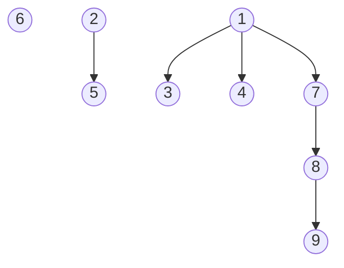
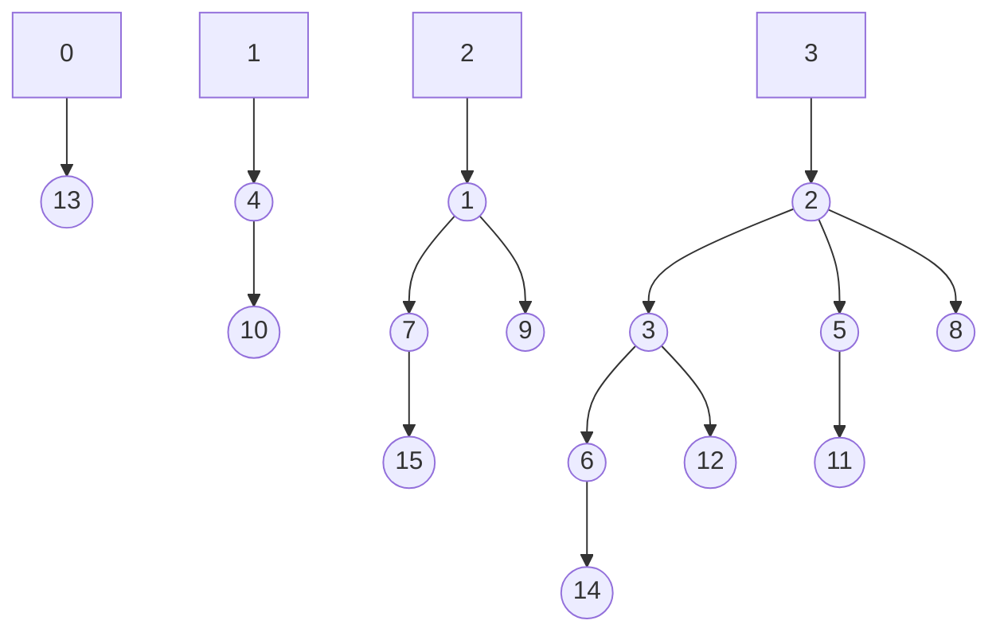

# [Homework 3](https://github.com/hanggrian/IIT-CS535/blob/assets/assignments/hw3.pdf)

## Problem 1

> For Fibonacci heaps, the rule for cutting during the cascade is to cut a node
  from its parent after it loses 2 children. What if instead, the cut is done
  this after losing one child? Will the degree of every root still be provable
  $O(lg(n))$? Same question, if instead of 2 above one uses an integer $k > 2$.
>
> > ```
> > FIB-HEAP-DECREASE-KEY(H, x, k)
> > 1   if k > x.key
> > 2     error "new key is greater than current key"
> > 3   x.key = k
> > 4   y = x.p
> > 5   if y != NIL and x.key < y.key
> > 6     CUT(H, x, y)
> > 7     CASCADING-CUT(H, y)
> > 8   if x.key < H.min.key
> > 9     H.min = x
> >
> > CUT(H, x, y)
> > 1   remove x from the child list of y, decrementing y.degree
> > 2   add x to the root list of H
> > 3   x.p = NIL
> > 4   x.mark = FALSE
> >
> > CASCADING-CUT(H, y)
> > 1   z = y.p
> > 2   if z != NIL
> > 3     if y.mark == FALSE
> > 4       y.mark = TRUE
> > 5     else
> > 6       CUT(H, y, z)
> > 7       CASCADING-CUT(H, z)
> > ```



Fibonacci min-heaps are ordered trees where the parent is always smaller than
its children. When this rule is violated by `DECREASE-KEY`, the target node is
cut from its parent and the parent is marked. The parent is also cut if it is
already marked during a `DECREASE-KEY` operation on one of its children.

Suppose $S_k(d)$ is the minimum size of a subtree at a node of degree $d$. If
$k = 1$, then the target node is cut from its parent immediately without
marking. This means that Fibonacci growth starts from the beginning.

$$
\begin{align}
  S_1(0) &&= 1 \\
  S_1(1) &= 1 + S_1(0) &= 2 \\
  S_1(2) &= 1 + S_1(0) + S_1(1) &= 4 \\
  \vdots \\
  S_1(d) &= 1 + \sum_{i = 0}^{d - 1} S_1(i) &= 2^d
\end{align}
$$

Since the subtree size is smaller than the size of the entire tree,
$S_1(d) \leq n$.

$$
\begin{align}
  S_1(d) &\leq n \\
  2^d &\leq n \\
  d &\leq \lg(n) \\
  d &= \mathbf{O(\lg(n))}
\end{align}
$$

For any $k > 2$, a node can lose up to $k - 1$ children before being cut.
Therefore, $S_k(d) = d + 1$ until $k - 1$. The Fibonacci growth starts from $k$.

$$
\begin{align}
  S_k(0) &&= 1 \\
  S_k(1) &&= 2 \\
  \vdots \\
  S_k(k - 1) &&= k \\
  S_k(k) &= k + S_k(0) &= k + 1 \\
  S_k(k + 1) &= k + S_k(0) + S_k(1) &= k + 3 \\
  \vdots \\
  S_k(d) &= 1 + \sum_{i = 0}^{d - k} S_k(i)
\end{align}
$$

Since $S_k(d)$ grows with $d$, there is a constant $c$ such that
$S_k(d) \geq c^d$.

$$
\begin{align}
  S_k(d) &\leq n \\
  c^d &\leq n \\
  d &\leq \frac{\lg(n)}{\lg(c)} \\
  &\leq \frac{1}{\lg(c)} \cdot \underbrace{\lg(n)}_{dominant} \\
  d &= \mathbf{O(\lg(n))}
\end{align}
$$

Therefore, every root's degree is still $O(\lg(n))$ when $k \geq 1$.

## Problem 2

> Suppose the cascading cut rule for `DECREASE-KEY` were changed to "as soon as
  $x$ loses one child through a cut, cut the edge joining x and its parent."
  Prove that if the amortized times of `INSERT` and `UNION` are $O(1)$ and the
  amortized time of `EXTRACT-MIN` is $O(lg(n))$, then the amortized time of
  `DECREASE-KEY` cannot be $O(1)$, $n$ being the maximum number of elements in
  the data structure. That is, for any constant $c$, find an $n$ as number of
  elements, and a sequence of operations with $p$ `INSERT` and/or `UNION`, $q$
  `EXTRACT-MIN`, and $r$ `DECREASE-KEY`, such that the running time exceeds
  $c(p + q \cdot \lg(n) + r)$.
>
> Hint: one solution keeps all the trees in the Fibonacci Heaps in the shape of
  the trees in Binomial Heaps. Binomial trees $B_k$ have been seen in class, and
  are defined as follows: $B_0$ has exactly one node (root of degree 0). For
  $k > 1$, the binomial tree $B_k$ has a root with $k$ children, and if they are
  numbered from $0, 1, \ldots, k − 1$, child $i$ is the root of a subtree $B_i$.
  One can easily prove by induction that $B_k$ has height $k$ and exactly $2^k$
  nodes.
>
> > ```
> > FIB-HEAP-INSERT(H, x)
> > 1   x.degree = 0
> > 2   x.p = NIL
> > 3   x.child = NIL
> > 4   x.mark = FALSE
> > 5   if H.min == NIL
> > 6     create a root list for H containing just x
> > 7     H.min = x
> > 8   else
> > 9     insert x into H's root list
> > 10    if x.key < H.min.key
> > 11      H.min = x
> > 12  H.n = H.n + 1
> > ```
> >
> > ```
> > FIB-HEAP-UNION(H1, H2)
> > 1   H = MAKE-FIB-HEAP()
> > 2   H.min = H1.min
> > 3   concatenate the root list of H2 with that of H1
> > 4   if H1.min == NIL or (H2.min != NIL and H2.min.key < H1.min.key)
> > 5     H.min = H2.min
> > 6   H.n = H1.n + H2.n
> > 7   return H
> > ```
> >
> > ```
> > FIB-EXTRACT-MIN(H)
> > 1   z = H.min
> > 2   if z != NIL
> > 3     for each child x of z
> > 4       add x to the root list of H
> > 5       x.p = NIL
> > 6     remove z from the root list of H
> > 7     if z == z.right
> > 8       H.min = NIL
> > 9     else
> > 10      H.min = z.right
> > 11      CONSOLIDATE(H)
> > 12    H.n = H.n - 1
> > 13  return z
> >
> > CONSOLIDATE(H)
> > 1   let A[0..D(H.n)] be a new array
> > 2   for i = 0 to D(H.n)
> > 3     A[i] = NIL
> > 4   for each node w in the root list of H
> > 5     x = w
> > 6     d = x.degree
> > 7     while A[d] != NIL
> > 8       y = A[d] // another node with same degree as x
> > 9       if x.key > y.key
> > 10        exchange x with y
> > 11      FIB-HEAP-LINK(H, y, x)
> > 12      A[d] = NIL
> > 13      d = d + 1
> > 14    A[d] = x
> > 15  H.min = NIL
> > 16  for i = 0 to D(H.n)
> > 17    if A[i] != NIL
> > 18      if H.min == NIL
> > 19        create a root list for H containing just A[i]
> > 20        H.min = A[i]
> > 21      else
> > 22        insert A[i] into H's root list
> >
> > FIB-HEAP-LINK(H, y, x)
> > 1   remove y from the root list of H
> > 2   make y a child of x, incrementing x.degree
> > 3   y.mark = FALSE
> > ```



In binomial min-heaps, the node structure of a tree reappears in the next
higher-order tree, resulting in the tree sizes growing in ascending order. This
ensures that the size of each tree is $2^k$ where $k$ is the maximum degree of
the root. The `DECREASE-KEY` amortized cost is $\Theta(\lg(n))$, worse than
Fibonacci heap's $\Theta(1)$.

To prove that, in the Fibonacci heap, the amortized time of `DECREASE-KEY`
cannot be $O(1)$, we can build a heap in the structure of binomial trees to make
`DECREASE-KEY` expensive. Starting with an empty heap, we perform $n$ times of
`INSERT` and `UNION` operations.

$$
\begin{align}
  T(\textsf{building}) &=
    n \cdot T(\texttt{INSERT}) + (n - 1) \cdot T(\texttt{UNION}) \\
  &= n \cdot O(1) + (n - 1) \cdot O(1) \\
  &= n + (n - 1) \\
  &= 2 \cdot \underbrace{n}_\textsf{dominant} - 1 \\
  &= \mathbf{O(n)}
\end{align}
$$

Next, we perform a single `EXTRACT-MIN` call to remove the minimum root and
consolidate the trees, resulting in a tree of degree $k - 1$. In Fibonacci
heaps, the `EXTRACT-MIN` operation costs $O(\lg(n))$ amortized time.

Finally, each `DECREASE-KEY` operation will cut a node from its parent after
losing one child under the modified cascading cut rule. This will result in
multiple cuts, each costing $O(1)$. Since there are $k - 1$ children, we perform
$k - 1$ `DECREASE-KEY` operations.

$$
\begin{align}
  T(\texttt{DECREASE-KEY}) &= (k - 1) \cdot O(1) \\
  &= (\underbrace{\lg(n)}_\textsf{dominant} - 1) \cdot O(1) \\
  &= \mathbf{O(\lg(n))}
\end{align}
$$

For any constant $c$, we can choose $n$ such that $\lg(n) > c$ for sufficiently
large $n$.

$$
\begin{align}
  O(n) &> c \cdot
    (T(\textsf{building}) +
    T(\texttt{EXTRACT-MIN}) +
    T(\texttt{DECREASE-KEY})) \\
  &> c \cdot (\underbrace{n}_\textsf{dominant} + \lg(n) + \lg(n)) \\
  &> \mathbf{c \cdot n}
\end{align}
$$

Therefore, it is impossible for the amortized time of `DECREASE-KEY` to be
$O(1)$ with the modified cascading cut rule.
