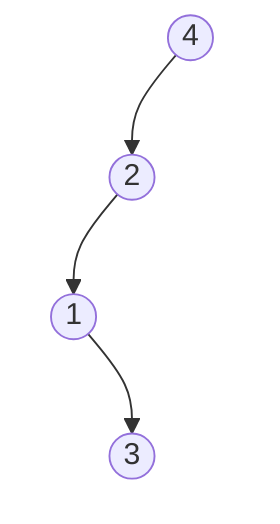
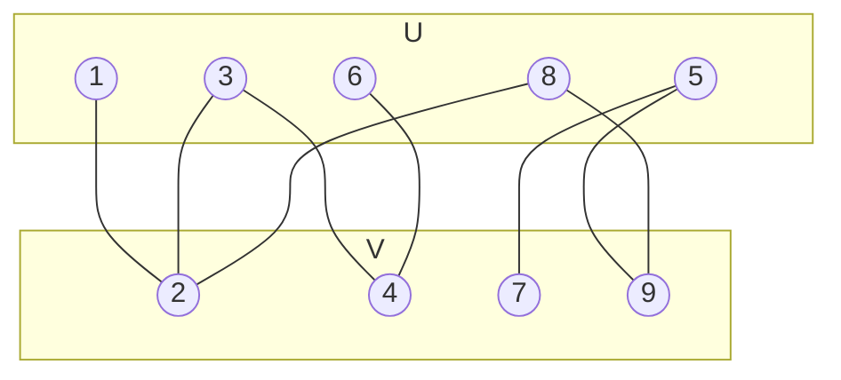

# [Homework 4](https://github.com/hanggrian/IIT-CS535/blob/assets/assignments/hw4.pdf)

## Problem 1

> When analyzing splay trees, we have defined the rank function on nodes:
  $r(v) = \lfloor \lg(|V(T_v)|) \rfloor$, where lg is the base 2 logarithm, and
  $T_v$ is the subtree rooted at $v$ ($v$ and all its descendants).
>
> We also called $r'(v)$ as being the rank of $v$ after one operation - a double
  rotation or a single rotation. We proved that the amortized cost of a double
  rotation at $x$ does not exceed $3 \cdot (r'(x) − r(x))$, and that the
  amortized cost of a single rotation at $x$ does not exceed
  $1 + 3 \cdot (r'(x) − r(x))$.
>
> This problem asks to show that the $+1$ term for a single rotation is needed.
  In other words, give an example of a binary search tree and a single rotation
  whose amortized cost as defined in class (actual cost plus the sum of ranks
  after the operation minus the sum of ranks before the operation) exceeds
  $3 \cdot (r'(x) − r(x))$.
>
> As an aside (no need to turn in anything about this paragraph), with single
  rotations only, the splay operations will not have amortized cost of
  $O(\lg(n))$ each.



Splay trees rotate nodes to bring them closer to the root for each search,
insert or delete operation, which preserves the binary search tree property. The
cost of a single rotation at node $x$ with parent $p$ is defined as
$r(x) + r(p)$, which can be defined as a potential function $\Phi$. Thus, the
amortized cost of a single rotation is $1 + \Phi' - \Phi$, where $1$ is the
actual rotation cost and $\Phi'$ is the potential after rotation.

We need to make sure that $1 + \Phi' - \Phi > 3 \cdot (r'(x) - r(x))$. To prove
that the $+1$ term is necessary, we can find an example where the rank
difference $r'(x) - r(x)$ is zero.

$$
\begin{align}
  1 + \Phi' - \Phi &> 3 \cdot (r'(x) - r(x)) \\
  1 + \underbrace{(r'(x) + r'(p)) - (r(x) + r(p))}_\textsf{0 \ldots ?} &>
    3 \cdot 0 \\
  1 &\geq 0 \\
  \hat{c} &\geq \mathbf{1}
\end{align}
$$

Consider a splay tree where root $p$ has left subtree $x$ of size $4$ excluding
itself. Before rotation, $T_x$ has $5$ nodes and $T_p$ has $6$ nodes. After
rotating $x$ to become the new root, $x$ will have its original left subtree,
while $p$ becomes the right child of $x$. Thus, $T'_x$ will have $6$ nodes and
$T'_p$ will have $4$ nodes.

$$
\begin{align}
  r(x) &= \lfloor \lg(|V(T_x)|) \rfloor \\
  &= \lfloor \lg(5) \rfloor \\
  &= \mathbf{2} \\

  r(p) &= \lfloor \lg(|V(T_p)|) \rfloor \\
  &= \lfloor \lg(6) \rfloor \\
  &= \mathbf{2} \\

  r'(x) &= \lfloor \lg(|V(T'_x)|) \rfloor \\
  &= \lfloor \lg(6) \rfloor \\
  &= \mathbf{2} \\

  r'(p) &= \lfloor \lg(|V(T'_p)|) \rfloor \\
  &= \lfloor \lg(4) \rfloor \\
  &= \mathbf{2} \\

  \hat{c} &= 1 + (r'(x) + r'(p)) - (r(x) + r(p)) \\
  &= 1 + (2 + 2) - (2 + 2) \\
  &= 1 + 4 - 4 \\
  &= \mathbf{1} \\

  3 \cdot (r'(x) - r(x)) &= 3 \cdot (2 - 2) \\
  &= 3 \cdot (0) \\
  &= \mathbf{0}
\end{align}
$$

Since $\hat{c}$ is larger than $3 \cdot (r'(x) - r(x))$, the bound alone is
insufficient. Therefore, the $+1$ term is necessary to cover the constant cost
of a single rotation.

$$
\begin{align}
  \hat{c} &\leq 3 \cdot (r'(x) - r(x)) \\
  1 \ &\cancel{\leq} \ \mathbf{0} \\

  \hat{c} &\leq 1 + 3 \cdot (r'(x) - r(x)) \\
  1 &\leq 1 + 3 \cdot 0 \\
  1 &\leq \mathbf{1}
\end{align}
$$

## Problem 2

> Suppose we implement the `UNION-FIND` Data structure with union-by-rank but no
  path-compression. For every $n$, give an example of a sequence of operation
  with $n$ `MAKE-SET`, $p$ `UNION` and $r$ `FIND` operations whose total running
  time exceeds $c \cdot (n + p + r) \cdot \lg(n)$ for some constant $c$. We also
  require that each element is a parameter in `FIND` at most once in this
  sequence (any element can appear many times in `UNION(,)` operations).

$n$ calls of `MAKE-SET` operation will produce $n$ disjoint sets, each with
rank 0. Then, perform $n - 1$ `UNION` calls to combine two sets of equal rank,
forming a tree with height $\lg(n)$. Each `UNION` calls `FIND` on the roots.
The total time for `UNION` operations is $O(p \cdot \lg(n))$ since the cost of
`FIND` is bounded by the height of the tree. Finally, perform $\frac{n}{2}$
`FIND` operations on leaf nodes, forcing traversal from root to leaf without
path compression.

$$
\begin{align}
  T(\texttt{MAKE-SET}\textsf{s}) &= n . 1 \\
  &= \mathbf{\Theta(n)} \\

  T(\texttt{UNION}\textsf{s}) &= p \cdot \lg(n) \\
  &= (\underbrace{n}_\textsf{dominant} - 1) \cdot
    \underbrace{\lg(n)}_\textsf{dominant} \\
  &= \mathbf{\Theta(n \cdot \lg(n))} \\

  T(\texttt{FIND}\textsf{s}) &= r \cdot \lg(n) \\
  &= (\underbrace{n}_\textsf{dominant} / 2) \cdot
    \underbrace{\lg(n)}_\textsf{dominant} \\
  &= \mathbf{\Theta(n \cdot \lg(n))} \\

  T(\textsf{total}) &= \
    T(\texttt{MAKE-SET}\textsf{s}) +
    T(\texttt{UNION}\textsf{s}) + \
    T(\texttt{FIND}\textsf{s}) \\
  &= \
    \Theta(n) +
    \underbrace{\Theta(n \cdot \lg(n))}_\textsf{dominant} +
    \Theta(n \cdot \lg(n)) \\
  &= \mathbf{\Theta(n \cdot \lg(n))} \\

  c \cdot (n + p + r) \cdot \lg(n) &=
    c \cdot (\underbrace{n}_\textsf{dominant} + (n - 1) + (n / 2)) \cdot
    \underbrace{\lg(n)}_\textsf{dominant} \\
  &= \mathbf{\Theta(n \cdot \lg(n))}
\end{align}
$$

The lower bound $c \cdot (n + p + r) \cdot \lg(n)$ can be defined as
$\Theta(n \cdot \lg(n))$ for some constant $c > 0$. Therefore, the total time
$T$ can match the lower bound complexity.

## Problem 3

> Given a $O(|V| + |E|)$ algorithm to determine if an undirected graph
  $G = (V, E)$ is bipartite. Prove that your algorithm is correct. The
  definition of a bipartite graph appears in the textbook. Hint: modify BFS or
  DFS.
>
> > ```
> > BFS(G, s)
> > 1   for each vertex u in G.V - {S}
> > 2     u.color = WHITE
> > 3     u.d = Infinity
> > 4     u.pi = NIL
> > 5   s.color = GRAY
> > 6   s.d = 0
> > 7   s.pi = NIL
> > 8   Q = 0
> > 9   ENQUEUE(Q, s)
> > 10  while Q != 0
> > 11    u = DEQUEUE(Q)
> > 12    for each v in G.Adj[u]
> > 13      if v.color == WHITE
> > 14        v.color = GRAY
> > 15        v.d = u.d + 1
> > 16        v.pi = u
> > 17        ENQUEUE(Q, v)
> > 18    u.color = BLACK
> >
> > ENQUEUE(Q, x)
> > 1   Q[Q.tail] = x
> > 2   if Q.tail == Q.length
> > 3     Q.tail = 1
> > 4   else Q.tail = Q.tail + 1
> >
> > DEQUEUE(Q)
> > 1   x = Q[Q.head]
> > 2   if Q.head == Q.length
> > 3     Q.head = 1
> > 4   else Q.head = Q.head + 1
> > 5   return x
> > ```



In an undirected graph, it can be described as bipartite when its vertices are
divisible into two sides where every edge is connected to a vertex from a
different side. Additionally, a bipartite graph does not contain any odd-length
cycle.

Currently, the `BFS` function from the textbook colorizes vertices based on
their traversal state: white (unvisited), gray (discovered) and black
(explored). To validate a graph's bipartite properties, we can modify the
purpose of colorization to represent which side a vertex belongs to: white
(unvisited), red (side U) and blue (side V). If there is an edge connecting
two vertices of the same non-white color during traversal, an odd-length cycle
is found, confirming that the graph is not bipartite.

```java
boolean isBipartite(Graph G) {
  for (Vertex u : G.V) {
    u.color = Color.WHITE;
  }

  for (Vertex s : G.V) {
    if (s.color != Color.WHITE) {
      continue;
    }
    s.color = Color.RED;
    Queue<Vertex> Q = new LinkedList<>();
    Q.add(s); // ENQUEUE

    while (!Q.isEmpty()) {
      Vertex u = Q.remove(); // DEQUEUE

      for (Vertex v : u.adj) {
        if (v.color == Color.WHITE) {
          v.color = (u.color == Color.RED) ? Color.BLUE : Color.RED;
          Q.add(v); // ENQUEUE
        } else if (v.color == u.color) {
          return false;
        }
      }
    }
  }
  return true;
}
```

There are no edges within colors red or blue when a graph $G$ is bipartite. This
ensures that condition `v.color == u.color` is never met, leading to returning
`true` at the end of the function. When $G$ is not bipartite, it must have at
least one odd-length cycle ($u_1, u_2, \ldots, u_k$) for odd number $k$. Because
the color assignment switches between two colors (red and blue), the last vertex
$u_k$ will have the same color as the first vertex $u_1$. Thus, the condition
`v.color == u.color` will be satisfied and returns `false`.

## Problem 4

> The input consists of n currencies $c_1, c_2, \ldots, c_n$ and an $n \times n$
  matrix $Q$ of exchange rates, such that one unit of currency $c_i$ buys
  $Q[i, j]$ units of currency $c_j$.
>
> 1.  Give an $O(|V|^3)$ algorithm to determine whether or not there exists a
      sequence of currencies
      $<c_{i_1}, c_{i_2}, \ldots, c_{i_{k - 1}}, c_{i_k}>$ such that
>
>     $$
>     Q[i_1, i_2] \cdot Q[i_2, i_3] \ldots
>       Q[i_{k − 1}, i_k] \cdot Q[i_k, i_1] >
>       1
>     $$
>
>     (as an aside, one can make guaranteed profit if such a sequence exists!).
      Discuss correctness and running time.
> 1.  Within the same time bounds, output such a sequence if it exists.

Each currency can be represented as a vertex in a directed graph, where an edge
from vertex $c_i \to c_j$ has weight $w(i, j) = \lg(Q[i, j])$. We can check
whether there is a profitable cycle by multiplying the exchange rates along the
cycle.

We can use the Floyd-Warshall algorithm to find shortest paths in known
$O(|V|^3)$ time. When the calculated weight of the edge from the vertex $c_i$ to
$c_j$ is a product greater than $1$, the weighted sum will be negative
$W[i][j] < 0$, determining that a profitable cycle is found.

```java
boolean hasProfit(double[][] Q) {
  int n = Q.length;
  double[][] W = new double[n][n];

  for (int i = 0; i < n; i++) {
    for (int j = 0; j < n; j++) {
      W[i][j] = -Math.log(Q[i][j]);
    }
  }

  for (int k = 0; k < n; k++) {
    for (int i = 0; i < n; i++) {
      for (int j = 0; j < n; j++) {
        if (W[i][k] + W[k][j] < W[i][j]) {
          W[i][j] = W[i][k] + W[k][j];
        }
      }
    }
  }

  for (int i = 0; i < n; i++) {
    if (W[i][i] < 0) {
      return true;
    }
  }
  return false;
}
```

The Floyd-Warshall algorithm requires three nested loops over all $n$, where
$n$ is the number of currencies. It is the heaviest operation in the function
and bounds the time complexity of the function to $O(n^3)$.
